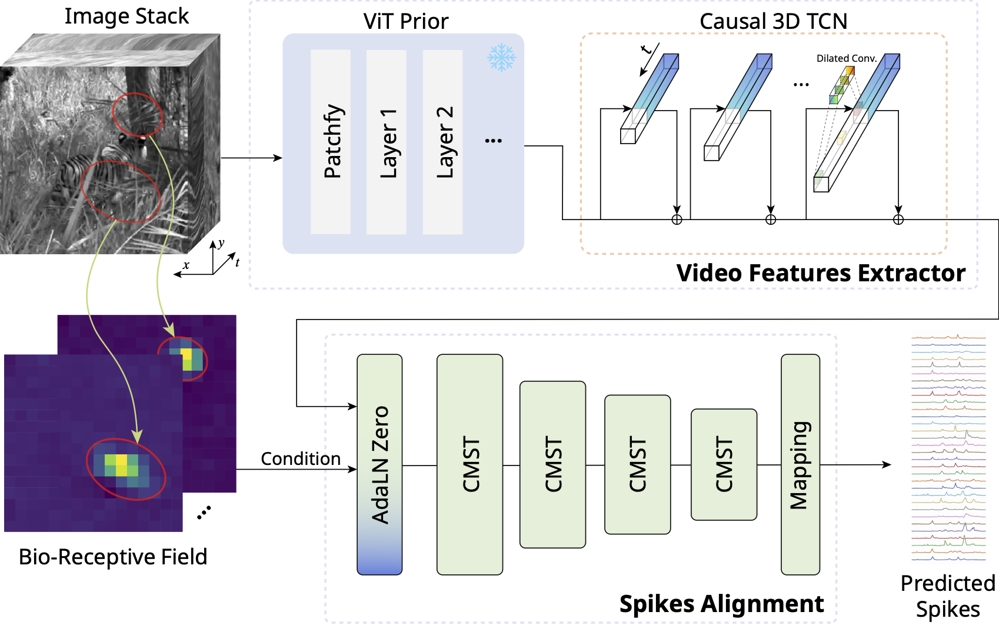

# Aligning Neuronal Coding of Dynamic Visual Scenes with Foundation Vision Models  (ECCV 2024)

### [Paper](https://www.arxiv.org/abs/2407.10737) | [Supplementary Material](<./docs/12149-supp.pdf>)



## Setup

> Due to the dataset size, we had to only include the code part and the checkpoint. The dataset is not included in this repository. Please find the dataset in:
>
> *Onken, Arno et al. (2017). Data from: Using matrix and tensor factorizations for the single-trial analysis of population spike trains [Dataset]. Dryad. <https://doi.org/10.5061/dryad.4ch10>*

```bash
# Install the required packages
pip3 install torch torchvision torchaudio lightning torchmetrics zarr
python -m pip install tslearn

# run train loop example
PYTORCH_CUDA_ALLOC_CONF=max_split_size_mb:256 \
PYTHONPATH=. python src/trainer/Trainer.py -m \
task_name=eccv model.featrue_key=dinov2_feats_0 \
model=eccv dataset.cross_val_movie=True dataset.movie_name=movie01,movie03 tags='["eccv"]'

# the predictions will be saved in the following directory
# Mov1 -> Mov2
checkpoints/0/checkpoints
# Mov2 -> Mov1
checkpoints/1/checkpoints
```

## BibTeX

```bibtex
@misc{Wu2024ViST,
      title={Aligning Neuronal Coding of Dynamic Visual Scenes with Foundation Vision Models}, 
      author={Rining Wu and Feixiang Zhou and Ziwei Yin and Jian K. Liu},
      year={2024},
      eprint={2407.10737},
      archivePrefix={arXiv},
      primaryClass={cs.CV},
      url={https://arxiv.org/abs/2407.10737}, 
}
```

## Acknowledgments

We thank Shanshan Jia, Zhile Yang, Zerui Yang and Jing Peng for the highly valuable discussions.
